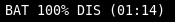

# battery

Show battery info.



# Dependencies

* `acpi`

# Config

```
[battery]
command=$SCRIPT_DIR/battery
interval=30
LABEL=BAT
#LABEL=⚡
#BAT_NUMBER=0
```

# Modifications
- Added nerd font icons for different battery levels, in increments of 10.
- Added support for custom colours provided by environment variables (`COLOR_CRITICAL`, `COLOR_LOW`, `COLOR_MEDIUM`, `COLOR_GOOD`).